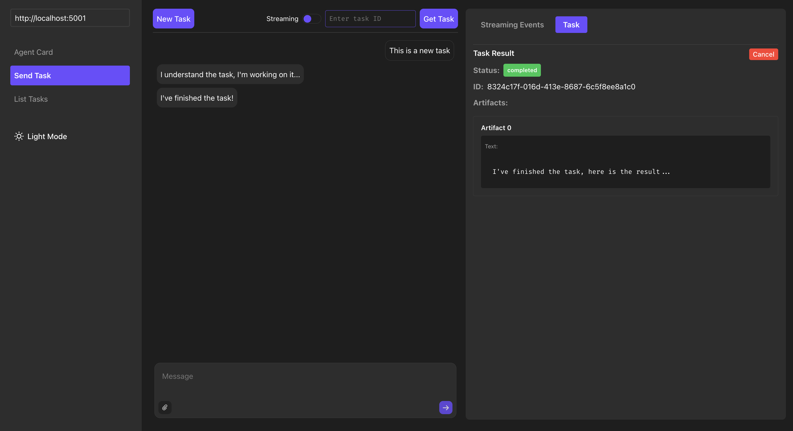

# Elkar


**The open-source protocol for sending, tracking, and orchestrating tasks across AI agents** — based on Google's Agent2Agent Protocol (A2A).

[Website](http://www.elkar.co) &nbsp;&nbsp;&nbsp; [💬 Discord](https://discord.gg/f5Znhcvm) &nbsp;&nbsp;&nbsp; [Open Issues](https://github.com/elkar-ai/elkar/issues) &nbsp;&nbsp;&nbsp; [Open PRs](https://github.com/elkar-ai/elkar/pulls)

## ✨ What is Elkar? 

Elkar is an open-source task manager for **AI agents** based on the A2A protocol.  Elkar provides a Python package to build and connect AI agents and a UI client to manage tasks and their history in a web interface (see in [a2a-client](https://github.com/elkar-ai/elkar/tree/main/a2a-client)).

Built on Google’s A2A Protocol, Elkar simplifies agent orchestration so developers can focus on building collaborative and autonomous multi-agent systems — not infrastructure. No more silos. 

## 🔧 What can you do with Elkar?
Collaborate across teams or tech stacks — even outside your org.
Use it to:
- **Track and manage long-running tasks** synchronously or asynchronously
- **Task debugging** with history and artifacts
- **Stream tasks** between agents in real-time
- **Browse and manage task history** for observability and debugging

**Disclaimer:** This project is still in early development.



### Applications:
- Consistent task management for AI agents
- Task orchestration between agents
- Task history for observability and debugging


## 📦 Python Package

The Python package provides a simple implementation of the A2A protocol for building and connecting AI agents. It includes:
- Full A2A protocol implementation
- Task-oriented. Built to focus on running tasks, not the infrastructure.
- Built-in and simplified task management with queue and store
- Support for streaming responses 
- Custom authentication via `RequestContext`


### Basic Usage

1. **Install dependencies**
```bash
pip install elkar
```

2. **Create an agent and run it!**
```python
from elkar.a2a_types import *
from elkar.server.server import A2AServer
from elkar.task_manager.task_manager_base import RequestContext
from elkar.task_manager.task_manager_with_task_modifier import TaskManagerWithModifier
from elkar.task_modifier.base import TaskModifierBase


agent_card = AgentCard(
    name="Test Agent",
    description="Test Agent Description",
    url="https://example.com",
    version="1.0.0",
    skills=[],
    capabilities=AgentCapabilities(
        streaming=True,
        pushNotifications=True,
        stateTransitionHistory=True,
    ),
)


async def task_handler(
    task: TaskModifierBase, request_context: RequestContext | None
) -> None:

    await task.set_status(
        TaskStatus(
            state=TaskState.WORKING,
            message=Message(
                role="agent",
                parts=[TextPart(text="I understand the task, I'm working on it...")],
            ),
        )
    )

    await task.upsert_artifacts(
        [
            Artifact(
                parts=[TextPart(text="I've finished the task, here is the result...")],
                index=0,
            )
        ]
    )

    await task.set_status(
        TaskStatus(
            state=TaskState.COMPLETED,
            message=Message(
                role="agent",
                parts=[TextPart(text="I've finished the task!")],
            ),
        ),
        is_final=True,
    )


task_manager: TaskManagerWithModifier = TaskManagerWithModifier(
    agent_card, send_task_handler=task_handler
)

# Create the server instance but don't start it
server = A2AServer(task_manager, host="0.0.0.0", port=5001, endpoint="/")

server.start()
```


### Supported task updates

1. **Status update**

It describes the state of the task and the agent's progress. If there is a message in the status, it will be appended to the task's history.
```python
await task.set_status(
    TaskStatus(
        state=TaskState.COMPLETED,
        message=Message(parts=[TextPart(text="I've finished the task!")])
    )
)
```


2. **Artifact update**  

Artifacts are the result of the task. Note that indices are important: they are used to identify the artifact in the task. An update works as an append operation: if an artifact with the same index already exists, it will be appended to the existing artifact if the chunk is not the last one.
```python
await task.upsert_artifact(
    Artifact(parts=[TextPart(text="I've finished the task!")], index=0)
)
```

3. **Append messages to history**

It is used to store relevant information as thoughts or past communications on the task.
```python
await task.add_messages_to_history(
    [Message(parts=[TextPart(text="I'm working on the task...")])]
)
```


### 📚 Roadmap
- Documentation
- Task stores:
    - Hosted Task store
    - PostgreSQL Task store
    - Redis Task store
- Task queues:
    - Hosted Task Queue
    - PostgreSQL Task Queue
    - Redis Task Queue
- Tests 
- Code samples
- Push notifications
- Task history search
- Tasks MCP (Model Context Protocol) for task management for agents


## 💬 Community
Join our [Discord server](https://discord.gg/f5Znhcvm)

## 🤝 Contribute
We ❤️ feedback, issues, PRs, and ideas!
Open a [pull request](https://github.com/elkar-ai/elkar/pulls), and we'll review it as soon as possible.

We ❤️ feedback, issues, PRs, and ideas! Here's how you can help:

Join our [Discord server](https://discord.gg/f5Znhcvm) to ask questions, share ideas, and get updates
- If you find Elkar useful, a GitHub ⭐️ would mean a lot! — it helps others discover the project and join the journey!
- Report bugs or request features via [issues](https://github.com/elkar-ai/elkar/issues).
- Build something with Elkar — and show it [here](https://discord.com/channels/1366517666054934589/1366528135730040862)! 
- Open a [pull request](https://github.com/elkar-ai/elkar/pulls), and we'll review it as soon as possible.


