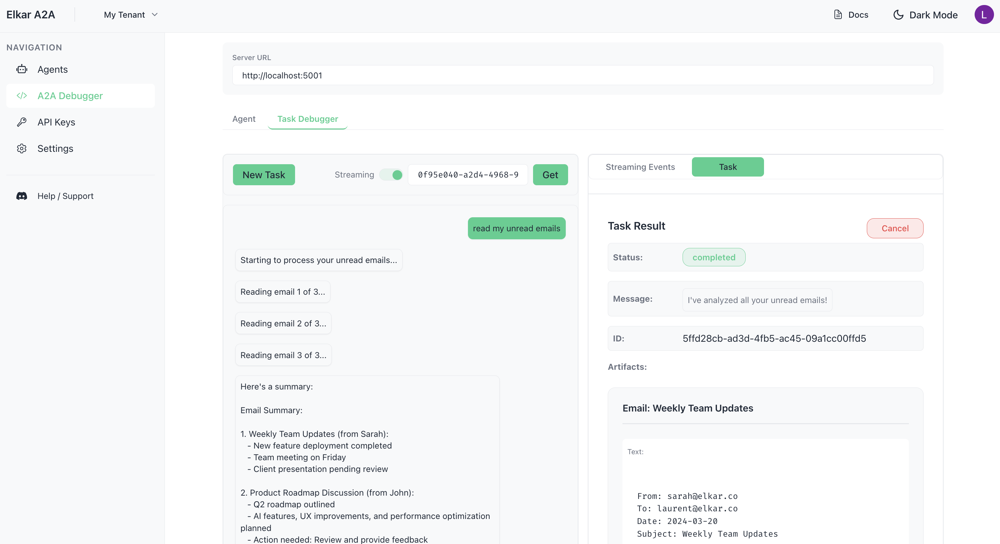

## 🖥️ Elkar A2A Client

The Elkar A2A client is a React + TypeScript application for testing and interacting with A2A-compatible servers.




### 🔧 Features
- Configure server URL (authentication coming soon)
- Send/Debug messages to A2A Servers with/without streaming
- Debug task status and responses
- Get task details by ID
- Display artifacts returned by agents
- Task management


### 🚀 Getting Started

1. **Install dependencies**
```bash
npm install
```

2. **Start the development server**
```bash
npm run dev
```

3. **Open your browser** at `http://localhost:5173`

### 📚 Usage
- Configure your A2A server URL and API key
- Send tasks and messages to agents
- Monitor task status and responses
- Manage task history and artifacts

### 🚧 Coming soon
- Authentication
- Host agents for real case testing (i.e. an agent that communicates with one or more other agents via the A2A protocol)
- Push notifications
- Resubscribe to tasks

