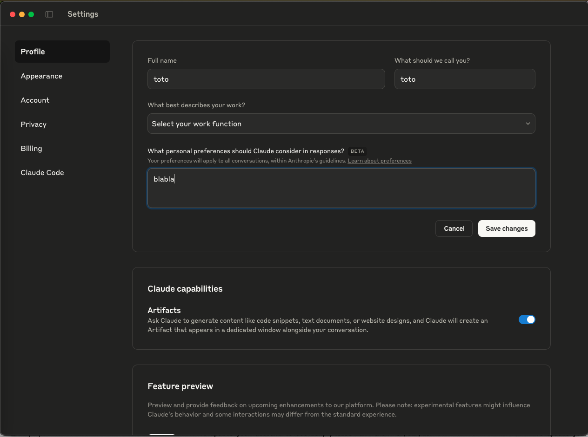
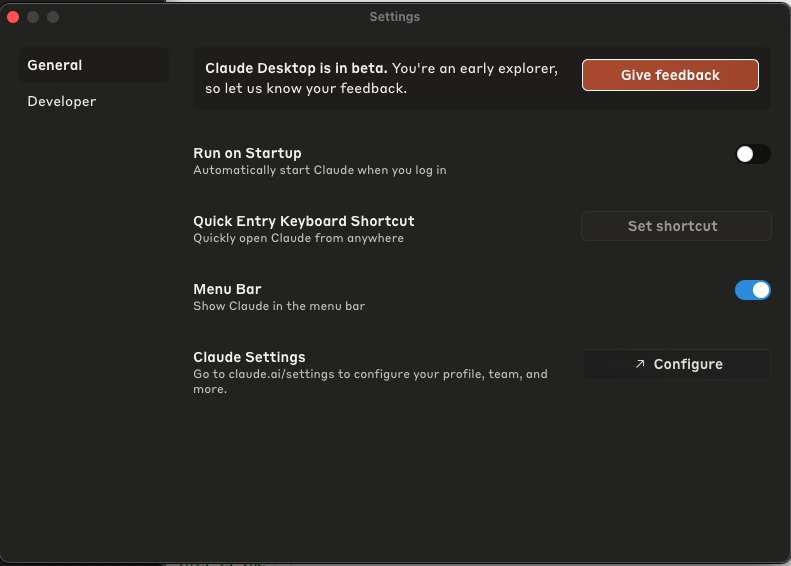

# Elkar A2A Google Services Integration

This project integrates Google Calendar and Gmail services with Elkar A2A, providing powerful email and calendar management capabilities.

## Prerequisites

- Python 3.8 or higher
- Google Cloud Platform account
- Claude Desktop application

## Google Services Setup

### 1. Enable Google APIs

1. Go to the [Google Cloud Console](https://console.cloud.google.com/)
2. Create a new project or select an existing one
3. Enable the following APIs:
   - Gmail API
   - Google Calendar API
4. Configure the OAuth consent screen:
   - Set up the OAuth consent screen with necessary scopes
   - Add test users if in testing mode

### 2. Download Credentials

1. In the Google Cloud Console, go to "APIs & Services" > "Credentials"
2. Click "Create Credentials" > "OAuth client ID"
3. Choose "Desktop application" as the application type
4. Download the credentials file and save it as `credentials.json` in the `example` directory

### 3. First-time Authentication

When you run the application for the first time:
- The system will automatically create `token.json` for Google Calendar
- The system will automatically create `gmail_token.json` for Gmail
- A browser window will open for OAuth authentication
- Grant the requested permissions

## Claude Desktop Configuration

### 1. Configure Claude Desktop

1. Locate your Claude Desktop configuration file:
   - Mac: `/Users/mm/Library/Application Support/Claude/claude_desktop_config.json`
   - Windows: `%APPDATA%\Claude\claude_desktop_config.json`
   - Linux: `~/.config/Claude/claude_desktop_config.json`

2. Add the MCP server configuration to the file:
```json
{
  "mcpServers": {
    "a2a_elkar": {
      "command": "/opt/anaconda3/bin/python",
      "args": ["/Users/mm/elkar-a2a/example/server_mcp.py"],
      "env": {
        "ANTHROPIC_API_KEY": "sk-xxx",
        "OPENAI_API_KEY": "sk-yyy",
        "AGENT_URLS": "http://localhost:5001,http://localhost:5002"
      }
    }
  }
}
```

### 2. Add Metaprompt

1. Open the Claude Desktop configuration file
2. Add the metaprompt from `claudePrompt.txt` to the appropriate section
3. Save the file

#### Example Claude Desktop Configuration Screenshots





## Running the Servers

1. Start the Gmail server:
```bash
python example/server.py
```

2. Start the Calendar server:
```bash
python example/server_cal.py
```

The servers will be available at:
- Gmail Assistant: http://localhost:5001
- Calendar Assistant: http://localhost:5002

## Troubleshooting

### Authentication Issues

If you encounter authentication issues:
1. Delete the existing token files (`token.json` and `gmail_token.json`)
2. Run the server with the `force_reauth` parameter
3. Complete the OAuth flow again

### Claude Desktop Issues

If Claude Desktop doesn't recognize the MCP servers:
1. Verify the configuration file path
2. Check the JSON syntax
3. Restart Claude Desktop
4. Ensure the servers are running before starting Claude Desktop

## Security Notes

- Keep your `credentials.json` file secure and never commit it to version control
- Regularly rotate your OAuth credentials
- Monitor the OAuth consent screen for any unauthorized access
- Use environment variables for sensitive configuration

## Support

For issues or questions:
1. Check the troubleshooting section
2. Review the Google Cloud Console logs
3. Check the server logs for detailed error messages
